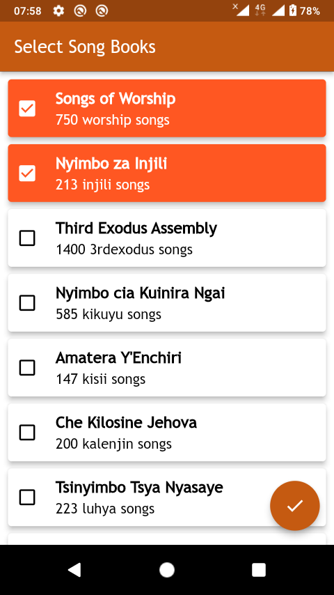
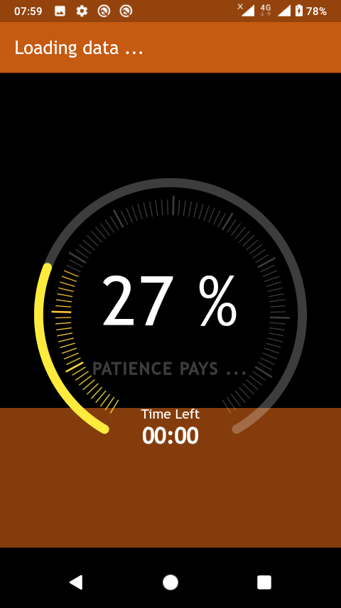

# Welcome to SongLib

<a href='https://play.google.com/store/apps/details?id=com.songlib'>
  
</a>

<a href="https://apps.apple.com/app/id6446771305">
  
</a>

<a href="https://github.com/Solido/awesome-flutter#components">
   
</a>

 SongLib for Android, iOS, Windows

## Overview

SongLib is a robust mobile solution tailored for our users who need to sing hymns, designed to streamline their operations and enhance productivity. This Flutter-based application facilitates their access to your church songbook/hymns seamlessly that you don't have to worry about even being online once you have set up the app on your device.
<table>
<tr>
<td></td>
<td></td>
<td></td>
<td></td>
<td></td>
</tr>
</table>


## Getting Started

Follow this guide to set up and run SongLib:

### Setting Up SongLib:

1. **Install Flutter and Dependencies:** Ensure Flutter is installed on your system. Download the Flutter SDK from the official website and set up your preferred IDE (e.g., Android Studio or Visual Studio Code) with the Flutter plugin.

2. **Clone the Repository:** Clone SongLib repository from GitHub using Git:

    ```bash
    git clone git@github.com:SiroDaves/SongLibApp.git
    ```

3. **Install Packages:** Navigate to the project directory and run:

    ```bash
    flutter pub get
    ```

### Running SongLib:

1. **Device Setup:** Connect an emulator or physical device to your development environment. Check connected devices:

    ```bash
    flutter devices
    ```

2. **Update Dependencies:**

    ```bash
    flutter pub get
    ```

3. **Update Code Generated Files:**

    ```bash
    dart run build_runner build --delete-conflicting-outputs
    ```

4. **Update Localization Strings:**

    ```bash
    flutter gen-l10n
    ```
5. **Running SongLib:**
    ```bash
    flutter run
    ```

### Building SongLib

1. **Android:**

    - **UAT: AppTester (Firebase Distribution):**

        ```bash
        flutter build apk --flavor uat -t lib/main_uat.dart --no-tree-shake-icons
        ```

    - **Production (For Play Store):**

        ```bash
        flutter build appbundle --flavor prod -t lib/main.dart --no-tree-shake-icons
        ```
2. **Windows:**

    ```
    flutter build windows --target=lib/main_prod.dart
    ```

---

Congratulations! You've successfully set up and run or built SongLib. Explore the codebase, make modifications, and contribute to creating a seamless experience for the users. Happy coding!